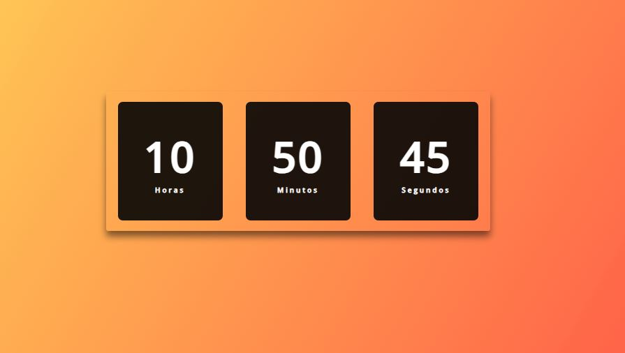

# Projetos em JavaScript

Este repositório contém Projetos desenvolvidos em JavaScript, HTML e CSS para aprimorar minhas habilidades de programação e criar projetos visualmente atraentes. Cada projeto é um exemplo prático de aplicação em diferentes contextos, porém sempre manipulando o DOM. O objetivo desse repositório é aprimorar minhas habilidades com JavaScript porém sempre criando projetos responsivos e bem apresentáveis.

## Projetos

### 1. Relógio Digital Dinâmico

Um relógio digital dinâmico que exibe a hora atual e é atualizado em tempo real.

### 2. Jogo da Memória

Um jogo da memória clássico em que o objetivo é encontrar os pares de cartas correspondentes.

### 3. Calculadora de IMC

Uma calculadora de Índice de Massa Corporal (IMC) que permite aos usuários calcular seu IMC com base no peso e altura fornecidos.

### 4. Calculadora de Juros Compostos

Uma calculadora de juros compostos que calcula o valor futuro de um investimento com base no valor principal, taxa de juros e período.

### 5. Gerador de Números Aleatórios

Um gerador de números aleatórios que permite aos usuários gerar números aleatórios dentro de um intervalo personalizado.

### 6. Contador

Um contador simples que permite aos usuários aumentar, diminuir e redefinir um valor contado.

### 7. CRUD - JS

Cadastro de Funcionários Responsivo, que é um CRUD, com armazenamento no Local Storage.

### 8. Calculadora

Calculadora do MacBook

### 9. Cronômetro

Cronômetro com opção de marcar o tempo.

### 10. Dark Mode

Dark Mode com JS

### 11. Gerador de Senhas

Gerador de Senhas com as opções: 
- Tamanho da senha
- Letras Minúsculas
- Letras Maiúsculas
- Números
- Símbolos

### 12. Player de Música

Player de Música com as funcões: play, pause, próxima música, música anterior, e Progress Bar onde o usuário clica em qualquer lugar da Progress Bar e a música alterna para aquele tempo exato.

### 13. Playlist de Vídeos

PlayList de Vários Vídeos feita com JS.

